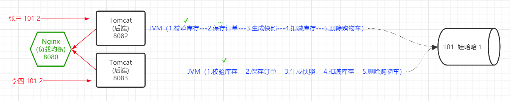
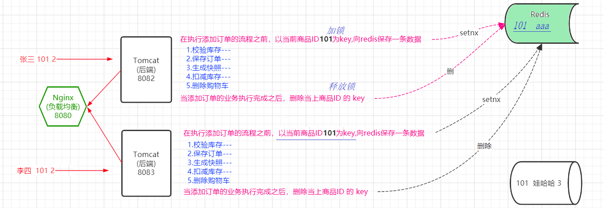

## 分布式锁

> 基于Redis实现分布式锁，解决分布式场景下的并发问题
>
> - 并发问题：多个并发的线程对同一个资源（数据）
> - 解决并发问题——锁
>   - 单机并发：JVM锁（synchronized）,ReentrantLock
>   - 分布式并发：分布式锁

### 电商系统的订单接口

1. **SPU和SKU**：在电商系统中，SPU和SKU是两个重要的概念。 

   - SPU代表"Standard Product Unit"，中文翻译为标准产品单元。它指的是一种产品的基本描述，包括产品的通用属性、特征和规格。SPU通常是一个产品的主体，用于区分不同的产品类型。例如，在服装电商中，一件T恤可以被视为一个SPU，它具有通用属性如颜色、尺码、款式等。  
   - 而SKU代表"Stock Keeping Unit"，中文翻译为库存量单位。它是对SPU的具体实例化，用于唯一标识一个具体的产品。SKU通常与库存管理和销售有关，每个SKU都有一个独特的编码或编号，用于追踪库存和销售情况。在电商系统中，一个SPU可以对应多个SKU，每个SKU代表不同的产品变体，如不同颜色、尺码或包装规格的产品。  
   - 简而言之，SPU是产品的通用描述，而SKU是对具体产品的唯一标识和管理。通过SPU和SKU的概念，电商系统可以更好地管理和展示各种产品，并进行库存和销售跟踪。

   

2. **商品快照**

   

### 一、分布式并发问题

> 提交订单：商品超卖问题



- 如何解决商品超卖问题？
  - 商品超卖是由于并发的订单提交请求引起的，既然是并发引起的，可以使用锁来解决；
  - 如果多个订单请求在同一台服务器，可以使用jvm锁来处理；
  - 如果多个订单请求在不同的服务器，JVM锁就不能解决分布式的并发问题，需要通过分布式锁来实现

### 二、如何解决分布式并发问题呢 ？

> 使用redis实现分布式锁
>
> - 加锁：在并发操作开始之前，执行setnx向redis添加一个key为商品ID的键值对，如果添加成功即加锁成功
> - 解锁：当并发操作结束之后，执行del从redis删除key为当前商品ID的键值对



### 三、分布并发问题-案例测试

#### 3.1 实现提交订单接口开发

1. 创建SpringBoot应用，整合mybatis-plus和redis

   - 创建SpringBoot应用，添加依赖

   

   - 手动添加mp的依赖
   - 配置数据源

   ```yaml
   spring:
     datasource:
       driver-class-name: com.mysql.cj.jdbc.Driver
       url: jdbc:mysql://localhost:3306/db_2302?characterEncoding=utf-8
       username: root
       password: '@QFedu123'
     redis:
       host: 1.12.255.11
       port: 6380
       database: 0
       password: 123456
   ```

2. 创建商品信息表

   ```sql
   -- ----------------------------
   -- Table structure for tb_products
   -- ----------------------------
   CREATE TABLE `tb_products`  (
     `product_id` int(0) NOT NULL AUTO_INCREMENT,
     `product_name` varchar(50) CHARACTER SET utf8 COLLATE utf8_general_ci NOT NULL,
     `product_desc` varchar(200) CHARACTER SET utf8 COLLATE utf8_general_ci NOT NULL,
     `product_stock` int(0) NULL DEFAULT NULL,
     PRIMARY KEY (`product_id`) USING BTREE
   ) ENGINE = InnoDB AUTO_INCREMENT = 11 CHARACTER SET = utf8 COLLATE = utf8_general_ci ROW_FORMAT = Dynamic;
   
   -- ----------------------------
   -- Records of tb_products
   -- ----------------------------
   INSERT INTO `tb_products` VALUES (1, '小米10', '小米10描述信息', 3);
   INSERT INTO `tb_products` VALUES (2, '华为P50', '华为P50描述信息', 12);
   INSERT INTO `tb_products` VALUES (3, '康佳电视', '康佳电视描述信息', 11);
   INSERT INTO `tb_products` VALUES (4, '铁三角麦克风', '铁三角麦克风描述信息', 9);
   INSERT INTO `tb_products` VALUES (5, '海尔冰箱', '海尔冰箱描述信息', 12);
   INSERT INTO `tb_products` VALUES (6, '美的空调', '美的空调描述信息', 6);
   INSERT INTO `tb_products` VALUES (7, '联想笔记本', '联想笔记本描述信息', 6);
   INSERT INTO `tb_products` VALUES (8, '哇哈哈', '哇哈哈描述信息', 6);
   INSERT INTO `tb_products` VALUES (9, 'test', 'testdesc', 6);
   INSERT INTO `tb_products` VALUES (10, '康师傅', '康师傅方便面', 6);
   
   SET FOREIGN_KEY_CHECKS = 1;
   ```

3. 完成提交订单接口

   - 创建实体类

   ```java
   @Data
   @NoArgsConstructor
   @AllArgsConstructor
   @TableName("tb_products")
   public class Product {
   
       @TableId(type = IdType.AUTO)
       private Integer productId;
       private String productName;
       private String productDesc;
       private Integer productStock;
   
   }
   ```

   - 创建Mapper接口

   ```java
   public interface ProductMapper extends BaseMapper<Product> {
   }
   ```

   - 创建Service

   ```java
   public interface OrderService {
   
       public ResultVO orderHandle(Integer productId, Integer num);
   
   }
   ```

   ```java
   @Service
   public class OrderServiceImpl implements OrderService {
   
       @Autowired
       private ProductMapper productMapper;
   
       @Override
       public ResultVO orderHandle(Integer productId, Integer num) {
           ResultVO vo = null;
           //1.校验库存
           Product product = productMapper.selectById(productId);
           if(product.getProductStock() >= num){
               //2.生成订单
               System.out.println("------生成订单");
               //3.生成订单快照
               System.out.println("------生成订单快照");
               //4.修改库存
               System.out.println("------修改库存");
               product.setProductStock(product.getProductStock()-num);
               productMapper.updateById(product);
               //5.删除购物车
               System.out.println("------删除购物车");
   
               System.out.println("成功购买【"+productId+"】商品【"+num+"】件");
               vo = new ResultVO(0,"下单成功",null);
           }else{
               vo = new ResultVO(1,"商品库存不足！",null);
           }
           return vo;
       }
   
   }
   ```

   - 创建Controller

   ```java
   @RestController
   @CrossOrigin
   @RequestMapping("/order")
   public class OrderController {
   
       @Autowired
       private OrderService orderService;
   
       @PostMapping("/submit")
       public ResultVO submitOrder(Integer productId, Integer num){
           return orderService.orderHandle(productId,num);
       }
   
   }
   ```

#### 3.2 高并发访问测试

> 100个并发请求同时购买一个商品——商品超卖

#### 3.3 使用JVM锁解决商品超卖问题

> 当后端项目单机部署时，使用JVM锁可以解决由于提交订单的并发请求导致的商品超卖问题


#### 3.4 分布式场景的并发访问测试

- 将项目进行集群部署

  

- 并发访问测试

  

- 出现了商品超卖：

  

#### 3.5 基于redis实现分布式锁

```java
@Service
public class OrderServiceImpl implements OrderService {

    @Autowired
    private ProductMapper productMapper;
    @Autowired
    private StringRedisTemplate stringRedisTemplate;

    //"1"
    @Override
    public ResultVO orderHandle(Long userId, Integer productId, Integer num) {
        //【加锁】：以当前订单的商品的id为key  执行setnx操作，如果操作成功则表示加锁成功
        Boolean lock = stringRedisTemplate.boundValueOps("product_" + productId).setIfAbsent("aaa");
        while(lock==false){
            lock = stringRedisTemplate.boundValueOps("product_" + productId).setIfAbsent("aaa");
        }
        try {
            //1.查询商品（Product）库存
            Product product = productMapper.selectById(productId);
            //2.校验库存（√）  stock>num
            if (product.getProductStock() >= num) {
                //3.生成/保存订单
                System.out.println("-----------生成订单");
                //4.保存订单快照
                System.out.println("-----------生成订单快照");
                //5.扣减库存
                int newStock = product.getProductStock() - num;
                product.setProductStock(newStock);
                int i = productMapper.updateById(product);
                System.out.println("------------订单提交完成！");
                return new ResultVO(0, "提交订单成功!", "orderId");
            } else {
                return new ResultVO(1, "库存不足", null);
            }
        }catch (Exception e){
            e.printStackTrace();
        }finally {
            //【释放锁】：当业务操作完成之后，删除加锁时设置的以商品id为key的 键值对
            stringRedisTemplate.delete("product_" + productId);
        }
        return null;
    }

}

```

### 四、阻塞锁与非阻塞锁

> - 阻塞锁：如果加锁失败，不断尝试获取锁，直到获取到锁为止
> - 非阻塞锁：如果获取不到锁就放弃，但可以支持在一定时间段内的重试
>
> ​                    ——在一段时间内如果没有获取到锁就放弃

自定义阻塞锁的实现

```java
public ResultVO orderHandle(Long userId, Integer productId, Integer num) {
        //【加锁】以当前订单的商品的id为key  执行setnx操作，如果操作成功则表示加锁成功
        Boolean lock = 
            stringRedisTemplate.boundValueOps("product_" + productId).setIfAbsent("aaa");
        // 阻塞锁：加锁失败不停的尝试加锁，直到加锁成功
        while(lock==false){
            lock = 
                stringRedisTemplate.boundValueOps("product_" + productId).setIfAbsent("aaa");
        }
        try {
            //1.查询商品（Product）库存
            Product product = productMapper.selectById(productId);
            //2.校验库存（√）  stock>num
            if (product.getProductStock() >= num) {
                //3.生成/保存订单
                System.out.println("-----------生成订单");
                //4.保存订单快照
                System.out.println("-----------生成订单快照");
                //5.扣减库存
                int newStock = product.getProductStock() - num;
                product.setProductStock(newStock);
                int i = productMapper.updateById(product);
                System.out.println("------------订单提交完成！");
                return new ResultVO(0, "提交订单成功!", "orderId");
            } else {
                return new ResultVO(1, "库存不足", null);
            }
        }catch (Exception e){
            e.printStackTrace();
        }finally {
            //【释放锁】
            stringRedisTemplate.delete("product_" + productId);
        }
        return null;
    }

```

自定义非阻塞锁的实现

```java
public ResultVO orderHandle2(Long userId, Integer productId, Integer num) {
        //【加锁】以当前订单的商品的id为key  执行setnx操作，如果操作成功则表示加锁成功
        Boolean lock = 
            stringRedisTemplate.boundValueOps("product_" + productId).setIfAbsent("aaa");
        long time1 = System.currentTimeMillis();
        while(lock==false && System.currentTimeMillis()-time1 < 3000){
            lock = 
                stringRedisTemplate.boundValueOps("product_" + productId).setIfAbsent("aaa");
        }
        try {
            if(lock){
                //1.查询商品（Product）库存
                Product product = productMapper.selectById(productId);
                //2.校验库存（√）  stock>num
                if (product.getProductStock() >= num) {
                    //3.生成/保存订单
                    System.out.println("-----------生成订单");
                    //4.保存订单快照
                    System.out.println("-----------生成订单快照");
                    //5.扣减库存
                    int newStock = product.getProductStock() - num;
                    product.setProductStock(newStock);
                    int i = productMapper.updateById(product);
                    System.out.println("------------订单提交完成！");
                    return new ResultVO(0, "提交订单成功!", "orderId");
                } else {
                    return new ResultVO(1, "库存不足", null);
                }

            }else{
                return new ResultVO(1, "订单提交失败！", null);
            }
        }catch (Exception e){
            e.printStackTrace();
        }finally {
            //【释放锁】
            stringRedisTemplate.delete("product_" + productId);
        }
        return null;
    }

```

### 五、公平锁和非公平锁

> **公平锁和非公平锁**
>
> \- 公平锁：当持有锁的线程释放锁之后，处于等待状态的线程按照线程的先后顺序获取锁
>
> \- 非公平锁：当持有锁的线程释放锁之后，多个正在等待的线程随机获取锁


### 六、完善分布式锁设计

#### 6.1 问题1


> 问题：如果一个线程加锁成功之后，当前服务器出现故障导致没有释放锁，其他服务器上的线程将无法成功加锁，如何解决这个问题？

> 解决方案：在对商品进行加锁时，设置过期时间，这样以来即使线程出现故障无法释放锁，在过期时间结束时也会自动“释放锁”

```java
Boolean isLock = stringRedisTemplate.boundValueOps("product_id_" + productId).setIfAbsent("aaa",30, TimeUnit.SECONDS);

```

#### 6.2 问题2

> 问题：当给锁设置了过期时间之后，如果当前线程t1因为特殊原因，在锁过期前没有完成业务执行，将会释放锁，同时其他线程（t2）就可以成功加锁了，当t2加锁成功之后，t1执行结束释放锁就会释放t2的锁,就会导致t2在无锁状态下执行业务。


> 解决方案：在加锁的时候，为每个商品设置唯一的value，当释放锁的时候，先查询redis中当前商品锁对应的值与加锁的时候设置的值是否一致，如果一致则释放锁

- 在加锁的时候，为每个商品设置唯一的value

- 在释放锁的时候，先获取当前商品在redis中对应的value，如果获取的值与当前value相同，则释放锁

  ```java
  @Override
  public ResultVO orderHandle(Long userId, Integer productId, Integer num) {
      //【加锁】以当前订单的商品的id为key  执行setnx操作，如果操作成功则表示加锁成功
      String lockValue = UUID.randomUUID().toString().replace("-","");
      Boolean lock = stringRedisTemplate.boundValueOps("product_" + 
                                      productId).setIfAbsent(lockValue,20, TimeUnit.SECONDS);
      // 阻塞锁：加锁失败不停的尝试加锁，直到加锁成功
      while(lock==false){
          lock = stringRedisTemplate.boundValueOps("product_" + productId).setIfAbsent("aaa");
      }
      try {
          //1.查询商品（Product）库存
          Product product = productMapper.selectById(productId);
          //2.校验库存（√）  stock>num
          if (product.getProductStock() >= num) {
              System.out.println("-----------生成订单");//3.生成/保存订单
              System.out.println("-----------生成订单快照");  //4.保存订单快照
              int newStock = product.getProductStock() - num; //5.扣减库存
              product.setProductStock(newStock);
              int i = productMapper.updateById(product);
              System.out.println("------------订单提交完成！");
              return new ResultVO(0, "提交订单成功!", "orderId");
          } else {
              return new ResultVO(1, "库存不足", null);
          }
      }catch (Exception e){
          e.printStackTrace();
      }finally {
          //【释放锁】
          String s = stringRedisTemplate.boundValueOps("product_" + productId).get();
          if(s!=null && s.equals(lockValue)){
              stringRedisTemplate.delete("product_" + productId);
          }
      }
      return null;
  }
  
  ```

#### 6.3 问题3


> 问题：当释放锁的时候，在查询并判断“这个锁是当前线程加的锁”成功之后，正要进行删除时锁过期了，并且被其他线程成功加锁，一样会导致当前线程删除其他线程的锁。

导致问题的原因：查询和删除是两个操作，存在时间空隙；要解决如上问题，必须保证查询操作和删除操作的原子性

解决方案：使用**lua脚本**解决查询和删除的原子性问题


- 在resources目录下创建`unlock.lua`,编辑脚本：

  ```lua
  if redis.call("get",KEYS[1]) == ARGV[1] then
      return redis.call("del",KEYS[1])
  else
      return 0
  end
  
  ```

- 配置Bean加载lua脚本

  ```java
  @Bean
  public DefaultRedisScript<List> defaultRedisScript(){
      DefaultRedisScript<List> defaultRedisScript = new DefaultRedisScript<>();
      defaultRedisScript.setResultType(List.class);
      defaultRedisScript.setScriptSource(new ResourceScriptSource(new ClassPathResource("unlock.lua")));
      return  defaultRedisScript;
  }
  
  ```

- 通过执行lua脚本解锁

  ```java
  @Override
  public ResultVO orderHandle(Long userId, Integer productId, Integer num) {
      //【加锁】以当前订单的商品的id为key  执行setnx操作，如果操作成功则表示加锁成功
      String lockValue = UUID.randomUUID().toString().replace("-","");
      Boolean lock = stringRedisTemplate.boundValueOps("product_" + 
                                      productId).setIfAbsent(lockValue,20, TimeUnit.SECONDS);
      // 阻塞锁：加锁失败不停的尝试加锁，直到加锁成功
      while(lock==false){
          lock = stringRedisTemplate.boundValueOps("product_" + productId).setIfAbsent("aaa");
      }
      try {
          //1.查询商品（Product）库存
          Product product = productMapper.selectById(productId);
          //2.校验库存（√）  stock>num
          if (product.getProductStock() >= num) {
              System.out.println("-----------生成订单");//3.生成/保存订单
              System.out.println("-----------生成订单快照");  //4.保存订单快照
              int newStock = product.getProductStock() - num; //5.扣减库存
              product.setProductStock(newStock);
              int i = productMapper.updateById(product);
              System.out.println("------------订单提交完成！");
              return new ResultVO(0, "提交订单成功!", "orderId");
          } else {
              return new ResultVO(1, "库存不足", null);
          }
      }catch (Exception e){
          e.printStackTrace();
      }finally {
          //【释放锁】：调用 unlock.lua
          List<String> keyList = new ArrayList<>();
          keyList.add("product_" + productId);
          List rs = stringRedisTemplate.execute(defaultRedisScript, keyList, lockValue);
          System.out.println(rs.get(0));
      }
      return null;
  }
  
  ```

#### 6.4 问题4


> 问题：当T1加锁时设置了过期时间可以解决因T1故障导致的锁不能释放的问题，但是带来了新的问题：T1业务执行时间过长，超过了锁的过期时间，这样在T1业务执行结束之前就会因锁过期释放锁，其他线程T2就可以成功加锁又会导致并发T1和T2并发操作数据导致的并发问题。 

**看门狗机制**

> 看门狗线程工作原理：
>
> - 监听当前线程锁的过期时间，当锁即将过期时如果业务没有执行结束，则重置锁的过期时间，保证业务线程正常执行的过程中，锁不会过期。


### 七、分布式锁框架-Redisson

> Redisson是基于`Redis+看门狗机制`的分布式锁框架

#### 7.1 Redisson介绍

Redisson在基于NIO的Netty框架上，充分的利用了Redis键值数据库提供的一系列优势，在Java实用工具包中常用接口的基础上，为使用者提供了一系列具有分布式特性的常用工具类。使得原本作为协调单机多线程并发程序的工具包获得了协调分布式多机多线程并发系统的能力，大大降低了设计和研发大规模分布式系统的难度。同时结合各富特色的分布式服务，更进一步简化了分布式环境中程序相互之间的协作

#### 7.2 在SpringBoot应用中使用Redisson

- 添加依赖

  ```xml
  <dependency>
      <groupId>org.redisson</groupId>
      <artifactId>redisson</artifactId>
      <version>3.12.0</version>
  </dependency>
  
  ```

- 配置yml

  ```yaml
  redisson:
    addr:
      singleAddr:
        host: redis://47.96.11.185:6380
        password: 123456
        database: 0
  
  ```

- 配置RedissonClient

  ```java
  @Configuration
  public class RedissonConfig {
  
      @Value("${redisson.addr.singleAddr.host}")
      private String host;
  
      @Value("${redisson.addr.singleAddr.password}")
      private String password;
  
      @Value("${redisson.addr.singleAddr.database}")
      private int database;
  
      @Bean
      public RedissonClient redissonClient(){
          Config config = new Config();
          config.useSingleServer()
              .setAddress(host)
              .setPassword(password)
              .setDatabase(database);
          return Redisson.create(config);
      }
  
  }
  
  ```

- 在秒杀业务实现中注入RedissonClient对象

  ```java
  @Service
  public class OrderServiceImpl2 implements OrderService {
      @Autowired
      private ProductMapper productMapper;
      @Autowired
      private StringRedisTemplate stringRedisTemplate;
      @Autowired
      private RedissonClient redissonClient;
  
      @Override
      public ResultVO orderHandle(Long userId, Integer productId, Integer num) {
          //构造锁
          RLock lock = redissonClient.getLock("product_" + productId);
          //加锁：阻塞锁
          lock.lock();
          try {
              //1.查询商品（Product）库存
              Product product = productMapper.selectById(productId);
              //2.校验库存（√）  stock>num
              if (product.getProductStock() >= num) {
                  System.out.println("-----------生成订单");//3.生成/保存订单
                  System.out.println("-----------生成订单快照");  //4.保存订单快照
                  int newStock = product.getProductStock() - num; //5.扣减库存
                  product.setProductStock(newStock);
                  int i = productMapper.updateById(product);
                  System.out.println("------------订单提交完成！");
                  return new ResultVO(0, "提交订单成功!", "orderId");
              } else {
                  return new ResultVO(1, "库存不足", null);
              }
          }catch (Exception e){
              e.printStackTrace();
          } finally {
              //释放锁
              lock.unlock();
          }
          return null;
      }
  }
  
  ```

#### 7.3 Redisson工作原理

> - Redis的setnx操作特性
> - “看门狗”线程

| Redisson工作原理图                       |
| ---------------------------------------- |
|  |

#### 7.4  Redisson使用扩展

###### 7.4.1 Redisson单机连接

- application.yml

  ```yaml
  redisson:
    addr:
      singleAddr:
        host: redis://47.96.11.185:6370
        password: 12345678
        database: 0
  
  ```

- RedissonConfig

  ```java
  @Configuration
  public class RedissonConfig {
  
      @Value("${redisson.addr.singleAddr.host}")
      private String host;
  
      @Value("${redisson.addr.singleAddr.password}")
      private String password;
  
      @Value("${redisson.addr.singleAddr.database}")
      private int database;
  
  
      @Bean
      public RedissonClient redissonClient(){
          Config config = new Config();
          config.useSingleServer()
              .setAddress(host)
              .setPassword(password)
              .setDatabase(database);
          return Redisson.create(config);
      }
  
  }
  
  ```

###### 7.4.2 Redisson集群连接

- application.yml

  ```yaml
  redisson:
    addr:
      cluster:
        hosts: redis://47.96.11.185:6370,...,redis://47.96.11.185:6373
        password: 12345678
  
  ```

- RedissonConfig——RedissonClient对象

  ```java
  @Configuration
  public class RedissonConfig {
  
      @Value("${redisson.addr.cluster.hosts}")
      private String hosts;
      @Value("${redisson.addr.cluster.password}")
      private String password;
  
      /**
       * 集群模式
       * @return
       */
      @Bean
      public RedissonClient redissonClient(){
          Config config = new Config();
          config.useClusterServers().addNodeAddress(hosts.split("[,]"))
                  .setPassword(password)
                  .setScanInterval(2000)
                  .setMasterConnectionPoolSize(10000)
                  .setSlaveConnectionPoolSize(10000);
          return Redisson.create(config);
      }
  
  }
  
  ```

###### 7.4.3 Redisson主从连接

- application.yml

  ```yaml
  redisson:
    addr:
      masterAndSlave:
        masterhost: redis://47.96.11.185:6370
        slavehosts: redis://47.96.11.185:6371,redis://47.96.11.185:6372
        password: 12345678
        database: 0
  
  ```

- RedissonConfig --- RedissonClient

  ```java
  @Configuration
  public class RedissonConfig3 {
  
      @Value("${redisson.addr.masterAndSlave.masterhost}")
      private String masterhost;
      @Value("${redisson.addr.masterAndSlave.slavehosts}")
      private String slavehosts;
      @Value("${redisson.addr.masterAndSlave.password}")
      private String password;
      @Value("${redisson.addr.masterAndSlave.database}")
      private int database;
  
      /**
       * 主从模式
       * @return
       */
      @Bean
      public RedissonClient redissonClient(){
          Config config = new Config();
          config.useMasterSlaveServers()
                  .setMasterAddress(masterhost)
                  .addSlaveAddress(slavehosts.split("[,]"))
                  .setPassword(password)
                  .setDatabase(database)
                  .setMasterConnectionPoolSize(10000)
                  .setSlaveConnectionPoolSize(10000);
          return Redisson.create(config);
      }
  
  }
  
  ```

#### 7.5 分布式锁使用

###### 7.5.1 分布式锁特点

1、互斥性
和我们本地锁一样互斥性是最基本，但是分布式锁需要保证在不同节点的不同线程的互斥。

2、可重入性
同一个节点上的同一个线程如果获取了锁之后那么也可以再次获取这个锁。

3、锁超时
和本地锁一样支持锁超时，加锁成功之后设置超时时间，以防止线程故障导致不释放锁，防止死锁。

4、高效，高可用
加锁和解锁需要高效，同时也需要保证高可用防止分布式锁失效，可以增加降级。

redission是基于redis的，redis的故障就会导致redission锁的故障，因此redission支持单节点redis、reids主从、reids集群

5、支持阻塞和非阻塞
和 ReentrantLock 一样支持 lock 和 trylock 以及 tryLock(long timeOut)。

###### 7.5.2 锁的分类的总结

1、乐观锁与悲观锁 

- 乐观锁
- 悲观锁

2、可重入锁和非可重入锁

- 可重入锁：当在一个线程中第一次成功获取锁之后，在此线程中就可以再次获取
- 非可重入锁

3、公平锁和非公平锁

- 公平锁：按照线程的先后顺序获取锁
- 非公平锁：多个线程随机获取锁

4、阻塞锁和非阻塞锁

- 阻塞锁：不断尝试获取锁，直到获取到锁为止

- 非阻塞锁：如果获取不到锁就放弃，但可以支持在一定时间段内的重试

  ​                    ——在一段时间内如果没有获取到锁就放弃

###### 7.5.3 Redission的使用

1、获取锁——公平锁和非公平锁

```java
//获取公平锁
RLock lock = redissonClient.getFairLock(skuId);

//获取非公平锁
RLock lock = redissonClient.getLock(skuId);

```

2、加锁——阻塞锁和非阻塞锁

```java
//阻塞锁（如果加锁成功之后，超时时间为30s；加锁成功开启看门狗，剩5s延长过期时间）
lock.lock();
//阻塞锁（如果加锁成功之后，设置自定义20s的超时时间）
lock.lock(20,TimeUnit.SECONDS);

//非阻塞锁（设置等待时间为3s；如果加锁成功默认超时间为30s）
boolean b = lock.tryLock(3,TimeUnit.SECONDS);
//非阻塞锁（设置等待时间为3s；如果加锁成功设置自定义超时间为20s）
boolean b = lock.tryLock(3,20,TimeUnit.SECONDS);

```

3、释放锁

```java
lock.unlock();

```

4、应用示例

```java
//公平非阻塞锁
RLock lock = redissonClient.getFairLock(skuId);
boolean b = lock.tryLock(3,TimeUnit.SECONDS);

```


